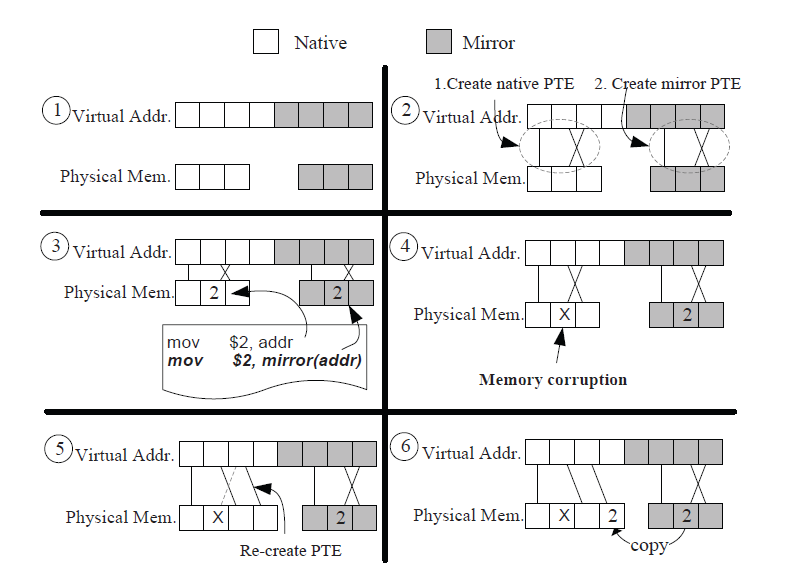
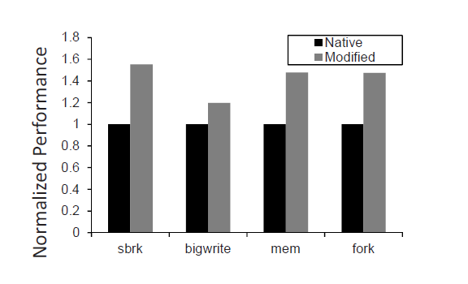

Introduction
=========
kMemvisor is a hypervisor providing software controlled memory mirroring based on hardware virtualization and static binary translation. Specifically, kMemvisor first creates a backup memory space with the same size of a specified memory for applications or virtual machines.  

MemV6 is a kMemvisor-like implementation for xv6. By modifying memory management module in the OS, MemV6 can achieve high-available memory access in xv6.   
  
The above picture shows the workflow of kMemvisor's strategy  
1. A block of physical memory will be reserved when a VM startups.  
2. When native PTEs are updated, the related mirror PTEs will also be created.  
3. Native instructions and mirror instructions will write the same data in different address.  
4. If a page is corrupted, a new page will be allocated to the VM.  
5. Map the virtual address to the new page.  
6. Copy data from the mirror address.  

Because of simplicity, we only implement memory redundant in MemV6.  
MemV6
=========
Memv6 will create the redundant page table while the native page table is created. When an application that has been binary translated runs, the duplicated memory write won't cause a page fualt. And the memory layout of xv6 is analyzed carefully so that there is no overlap between native address and redundant address.

Changed Files
---------
+ memlayout.h
+ vm.c
+ umalloc.c
+ sysproc.c
+ proc.c 
  
Binary Translate
----------
We use static binary translate to duplicate memory-write instructions so that every memory write will commit in mirrored memory either.  
The following picture shows the overall architecture of binary translation.  
  

Evaluation
----------
We evaluated the performance of usertest(xv6's benchmark) between native xv6 and MemV6. This usertest contains several memory tests and the result shows that the largest overhead is still less than 60% and the average overhead is only 43%.  

  
Reference
=========
[kMemvisor: flexible system wide memory mirroring in virtual environments.](http://dl.acm.org/citation.cfm?doid=2462902.2462910)  
[Memvisor: Application Level Memory Mirroring via Binary Translation](http://ieeexplore.ieee.org/xpl/articleDetails.jsp?tp=&arnumber=6337823)

# 静态二进制翻译

本项目当前并未实现静态二进制翻译功能。静态二进制翻译是一个复杂的过程，涉及将一种指令集架构的二进制代码转换为另一种架构的代码。这个功能的实现需要以下步骤:

1. 解析原始二进制代码
2. 分析代码的控制流和数据流
3. 将原始指令映射到目标架构的等效指令
4. 处理架构差异(如寄存器数量、内存模型等)
5. 生成新的二进制代码

如果需要添加静态二进制翻译功能，建议创建一个新的模块或组件来专门处理这个过程。这可能需要对项目进行重大修改和扩展。

目前，本项目主要聚焦于基本的操作系统内核功能实现。