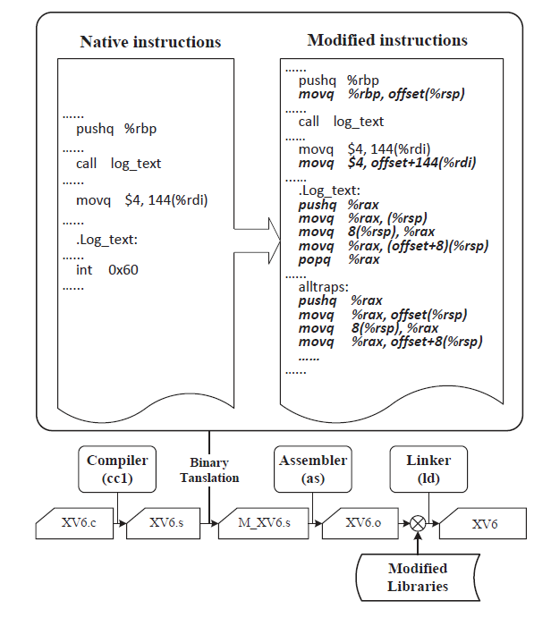

Introduction
=========

kMemvisor is a hypervisor providing software controlled memory mirroring based on hardware virtualization and static binary translation. Specifically, kMemvisor first creates a backup memory space with the same size of a specified memory for applications or virtual machines.  

MemV6 is a kMemvisor-like implementation for xv6. By modifying memory management module in the OS, MemV6 can achieve high-available memory access in xv6.
  
The above picture shows the workflow of kMemvisor's strategy  

1. A block of physical memory will be reserved when a VM startups.  
2. When native PTEs are updated, the related mirror PTEs will also be created.  
3. Native instructions and mirror instructions will write the same data in different address.  
4. If a page is corrupted, a new page will be allocated to the VM.  
5. Map the virtual address to the new page.  
6. Copy data from the mirror address.  

Because of simplicity, we only implement memory redundant in MemV6.  
MemV6
=========

Memv6 will create the redundant page table while the native page table is created. When an application that has been binary translated runs, the duplicated memory write won't cause a page fualt. And the memory layout of xv6 is analyzed carefully so that there is no overlap between native address and redundant address.

Changed Files
---------

+ memlayout.h
+ vm.c
+ umalloc.c
+ sysproc.c
+ proc.c
  
Binary Translate
----------

We use static binary translate to duplicate memory-write instructions so that every memory write will commit in mirrored memory either.  
The following picture shows the overall architecture of binary translation.  
  

Evaluation
----------

We evaluated the performance of usertest(xv6's benchmark) between native xv6 and MemV6. This usertest contains several memory tests and the result shows that the largest overhead is still less than 60% and the average overhead is only 43%.  

  
Reference
=========

[kMemvisor: flexible system wide memory mirroring in virtual environments.](http://dl.acm.org/citation.cfm?doid=2462902.2462910)  
[Memvisor: Application Level Memory Mirroring via Binary Translation](http://ieeexplore.ieee.org/xpl/articleDetails.jsp?tp=&arnumber=6337823)

# 静态二进制翻译

本项目当前并未实现静态二进制翻译功能。静态二进制翻译是一个复杂的过程，涉及将一种指令集架构的二进制代码转换为另一种架构的代码。这个功能的实现需要以下步骤:

1. 解析原始二进制代码
2. 分析代码的控制流和数据流
3. 将原始指令映射到目标架构的等效指令
4. 处理架构差异(如寄存器数量、内存模型等)
5. 生成新的二进制代码

如果需要添加静态二进制翻译功能，建议创建一个新的模块或组件来专门处理这个过程。这可能需要对项目进行重大修改和扩展。

目前，本项目主要聚焦于基本的操作系统内核功能实现。

# KMemvisor

KMemvisor是一个基于xv6操作系统实现的简单虚拟机监视器(VMM)。它通过修改xv6的内存管理子系统来实现虚拟化功能。

## VMM实现概述

KMemvisor的VMM功能主要通过以下方式实现:

1. **地址空间镜像**: 在`vm.c`中，通过修改`mappages`函数实现了地址空间镜像。这允许guest OS访问mirror地址，而实际上访问的是host物理内存。

2. **内存分配管理**: 在`kalloc.c`中，`kfree`函数被修改以忽略mirror地址的释放，确保guest OS不会意外释放host的内存。

3. **页表管理**: `vm.c`中的`setupkvm`, `copyuvm`等函数可能被修改以支持guest页表的创建和管理。

4. **进程管理**: `proc.c`中的进程管理相关函数(如`fork`, `exit`, `wait`等)可能被修改以支持guest进程的管理。

5. **中断和异常处理**: 虽然在提供的代码中没有直接体现，但完整的VMM实现需要处理guest OS的中断和异常。

## 关键文件及其作用

- `vm.c`: 实现虚拟内存管理，包括地址空间镜像
- `kalloc.c`: 实现物理内存分配，修改以支持虚拟化
- `proc.c`: 实现进程管理，可能被修改以支持guest进程
- `trap.c` (未提供): 可能包含中断和异常处理的修改

## 虚拟化特性

1. **内存隔离**: 通过地址空间镜像和修改的内存管理，KMemvisor确保guest OS无法直接访问或修改host内存。

2. **资源管理**: 修改的内存分配和释放机制确保guest OS的内存操作不会影响host系统。

3. **性能**: 地址空间镜像技术允许大部分guest内存访问直接映射到host物理内存，减少了虚拟化开销。

## 局限性

1. 当前实现主要关注内存虚拟化，可能缺少完整的CPU虚拟化和I/O虚拟化。
2. 缺乏多guest支持，可能只能运行单个guest OS。
3. 安全特性可能不完善，需要进一步增强以防止guest OS的潜在攻击。

## 未来改进

1. 实现完整的CPU虚拟化，包括特权指令的模拟。
2. 添加I/O虚拟化支持。
3. 增强安全特性，如EPT(扩展页表)支持。
4. 添加多guest支持。
5. 优化性能，减少VM exits。

KMemvisor展示了基于xv6实现简单VMM的可能性，为理解和学习虚拟化技术提供了一个有价值的起点。